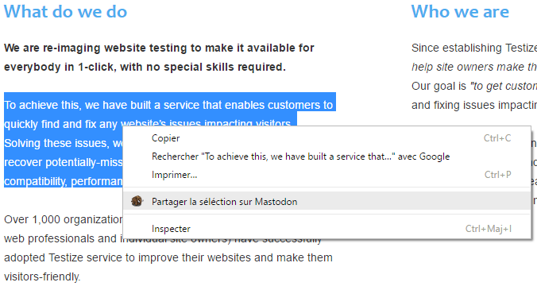

# Mastoshare
Un bouton de partage social pour Mastodon

## Premiere utilisation
Cliquez sur le bouton Mastodon Share et configurez l'url de votre instance Mastodon.

Pour partager sur Mastodon, cliquez de nouveau sur le bouton.

## En images

#### Partagez une selection de texte sur Mastodon

#### Partagez sur Mastodon directement depuis Twitter

#### Panneau des paramètres

## L'extension

#### Google Chrome
https://chrome.google.com/webstore/detail/mastodon-share/ngkommdldcakheaeoafgakbbiinkohom?hl=fr

#### Mozilla Firefox
https://addons.mozilla.org/fr/firefox/addon/mastodon-share/

## Roadmap
- Definir une nouvelle icone pour l'extension (Suggestions bienvenues)
- Ajouter le partage depuis d'autres reseaux sociaux

