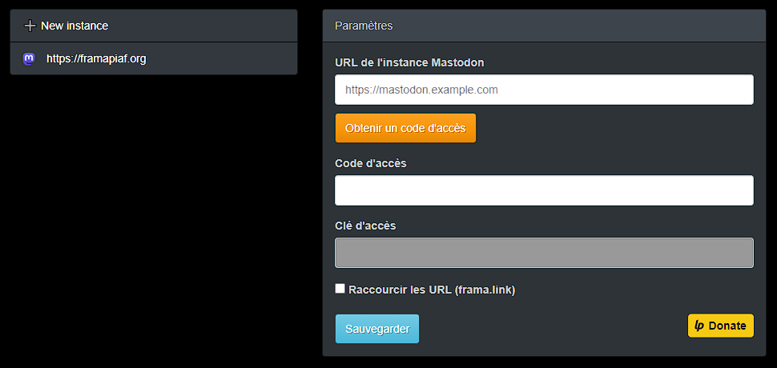

<strong style="color:red">TEMPORARY ISSUE WITH STORES
- Firefox: Due to an issue with firefox, the extension is not anymore on the store.
- Chrome: Due to the new and unnecessary complicated conditions to post the extension is not anymore on the store.

⚠️ Please use the zip in the build directory until a solution.

Sorry for the inconvenience.
</strong>

# Mastodon Share
A share button for Mastodon Social Network

## First usage
Go to the option panel of the plugin and set your Mastodon instance url.

## Features

#### Share pages on Mastodon

### Automatic hashtags
When you share a page, hashtags has generated from page keywords

#### Configuration panel

## Download the public extension

#### Google Chrome (Not available, broken, please use the zip on build directory)
<strike>https://chrome.google.com/webstore/detail/mastodon-share/ngkommdldcakheaeoafgakbbiinkohom?hl=fr</strike>

#### Mozilla Firefox (Not available, broken, please use the zip on build directory)
<strike>https://addons.mozilla.org/firefox/addon/mastodon-share/</strike>

## How to build the extension from sources
You need to have nodejs with npm installed
- Open command line console / terminal
- Set "npm install"
- Set "gulp"
- The extension is compiled for chrome and firefox and placed on "build" directory (do not use "src" directory to install the extension in your browser)

## How to help on translation

In tools directory launch i18n.bat / i18n.sh
  

  
- Choose the locale you want to test (default is "en" for English)
- A chrome browser window opening in the selected lang.
- Test the extension
  
 You can edit the locales files in the "/src/_locales/" directory.
 

